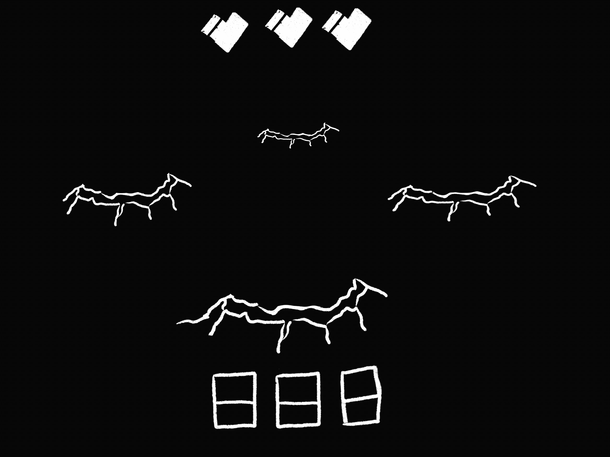

# EC-311-Project: FPGA Whack-a-Mole

_____________________________________________________
Team Members: Arielle, Mirclea, Jacob, Mingshan, Kofi

Link to demo video: https://drive.google.com/file/d/1l9CKNrL4KhFVmzEyHfuliI95gUjf9PbO/view?usp=share_link

## Project Overview: 
In this project, we implemented whack-a-mole on the Nexys A7 FPGA. The final project uses the VGA cable to display the game logic on the monitor and uses both buttons and tilt controls as input. Upon a button click or tilt input, the game launches into the game loop where you have 3 lives and score points by giving the correct input to the given mole on the screen. If you are too slow, or give the wrong input, you loosea a life. The goal is to beat the game by getting 64 points, where every 8 points added to the score speeds up the game. The game saves the current highest score and displays it in the end state. Pressing the reset button resets the game and high score. (Clarify if this is outdated!!)

## How to run it:
To run the game, download the bitstream onto the FPGA (TODO!!!!)
- with_acc.xdc, with_acc_final, spi, button control, iclk_gen, debouner, whacl_a_mole_Advanced
- 
## Code Overview:
Generally, the code can be split into those for the simple version of the game and the advanced version, where those for the latter have the word "advanced" included in their titles...(add more descriptions)

## Additional Notes:
Mirclea wrote the accelerometer modules, Arielle wrote the the VGA modules, Jacob wrote the game logic modules, Mingshan wrote the RNG module and matlab image converter, and Kofi wrote... (please update this so it is accurate to your work!!)

## Some sources
- accelerometer tutorial: https://github.com/FPGADude/Digital-Design/tree/main/FPGA%20Projects/Nexys%20A7%203-Axis%20Accelerometer%20SPI

